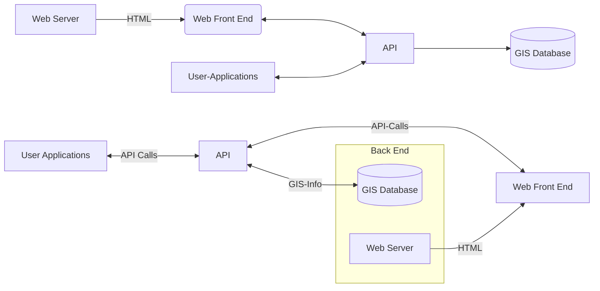

```mermaid
flowchart LR
    A["Web Server"] -- HTML --> B("Web Front End")
    B <--> n1["API"]
    User-Applications["User-Applications"] <--> n1
    n1 --> dbI[("GIS Database")]
    Start["User Applications"] <-- API Calls --> API["API"]
    API <-- API-Calls --> WB1["Web Front End"]
    API <-- "GIS-Info" --> DB[("GIS Database")]
    AA["Web Server"] -- HTML --> WB1
    subgraph Back End
    DB
    AA
    end
```
